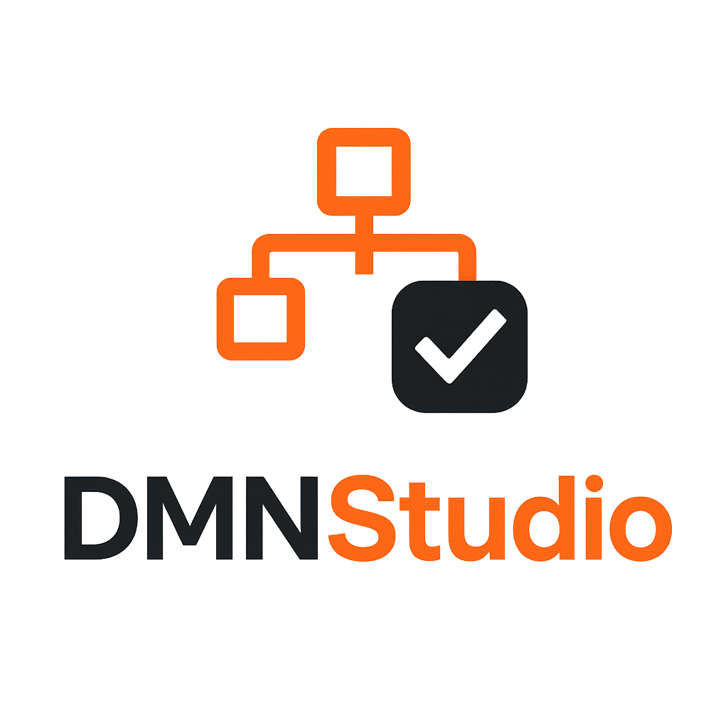

# DMN Studio Backend
[](https://github.com/SynTouchNL/DMNStudioBackend/actions/workflows/docker-publish.yml)



# Overzicht
_Meer high-level informatie over het bestaansrecht van DMNStudio kan [hier](https://dienstverleningsplatform.gitbook.io/platform-generieke-dienstverlening-public/onderzoeken/beslisregels-dmn) gevonden worden. De archtectuur beschrijving van DMNStudio staat [hier](https://dienstverleningsplatform.gitbook.io/platform-generieke-dienstverlening-public/onderzoeken/beslisregels-dmn/dmnstudio)_
DMNStudio is een webapplicatie die kan worden gebruikt om beslissingsmodellen te modelleren, testen en goedkeuren. Het biedt een gestructureerde en flexibele werkomgeving waarin beslissingsmodellen per werkdomein kunnen worden gecreëerd, gevalideerd en goedgekeurd. Na goedkeuring kunnen deze modellen worden uitgerold naar verschillende omgevingen (test, acceptatie en productie) voor integratie met bestaande applicaties.

## Voordelen
- Volledig open source
- Het haalt de business logica (Leges, kosten, beslissingen) uit de applicaties
- Geen programmeur nodig voor opstellen en wijzigen van de business logica
- Low code; De modellen kunnen door functionele business personen zonder technische kennis worden ontwikkeld.
- Ingebouwde stappen voor testen en goedkeuring 
- Beslissingsmodellen zijn snel en duidelijk testbaar
- Eenvoudig uitrollen over omgevingen
- Deelbare bouwblokken binnen en buiten de eigen organisatie
- Lage kosten voor ontwikkeling en voortbrenging
- Haven plus compliant, dus cloud onafhankelijk

## Doelgroep
De primaire gebruikers van DMNStudio zijn functionele beheerders en gebruikers binnen een organisatie, zoals beleidsmedewerkers, procesbeheerders, en applicatiebeheerders. Zij hebben geen diepgaande technische kennis nodig om de applicatie te gebruiken, maar moeten wel in staat zijn om beslissingsmodellen te begrijpen en te beheren.

## Belangrijkste Functionaliteiten
1. Modelleeromgeving voor Beslissingsmodellen
- Keuze voor Werkdomein: Gebruikers kunnen beslissingsmodellen creëren voor specifieke werkdomeinen, zoals vergunningverlening, handhaving, jeugdzorg, belastingheffing, etc.
- Grafische Modelbouwer: Een intuïtieve interface om beslissingsmodellen en beslistabellen met als-dan beslissingen te maken gebaseerd op de DMN (Decision Model and Notation) standaard.
- Keuzes en Beslissingen: Gebruikers kunnen verschillende regels, beslissingen en keuzes definiëren binnen een model.

2. Validatie en Testen
- Testscenario’s: Gebruikers kunnen testscenario’s opstellen met specifieke invoerwaarden en verwachte uitvoerwaarde(n) om de werking van beslissingsmodellen te simuleren.
- Resultaatanalyse: Het systeem toont de output van testscenario’s en biedt feedback over eventuele afwijkingen van de verwachte uitkomst.
- Versiebeheer: Elke wijziging aan een model wordt opgeslagen met versiebeheer, zodat gebruikers oude versies kunnen raadplegen of terugdraaien naar eerdere versies.

3. Goedkeuringsproces
- Goedkeuring: Elk beslissingsmodel en versie daarvan dient goedgekeurd te worden door een daartoe bevoegde en daarvoor aangewezen beheerder of procesverantwoordelijke alvorens deze kan worden uitgerold over de omgevingen.

4. Uitrol naar Omgevingen
- Stapsgewijze Uitrol: Na goedkeuring kan het beslissingsmodel worden uitgerold naar verschillende omgevingen:
  - Testomgeving: Om het model te testen in een gecontroleerde omgeving zonder impact op de productie.
  - Acceptatieomgeving: Waar gebruikers in een meer realistische omgeving kunnen controleren of het model voldoet aan de functionele eisen.
  - Productieomgeving: Het model wordt geactiveerd en beschikbaar voor gebruik in bestaande applicaties.

5. Integratie met bestaande Applicaties binnen de organisatie
- Koppelingen met Applicaties: Na goedkeuring kunnen de beslissingsmodellen via API’s beschikbaar worden gesteld aan de bestaande applicaties, zoals geautomatiseerde systemen voor vergunningverlening of belastingheffing.
- Realtime Toepassing: Beslissingsmodellen kunnen in realtime beslissingen nemen en terugkoppeling geven aan de operationele systemen binnen de organisatie.

6. Beveiliging en Toegangsbeheer
- Gebruikersrollen en Machtigingen: Het systeem ondersteunt verschillende gebruikersrollen (beheerder, functioneel gebruiker, goedkeurder) met specifieke rechten.
- Authenticatie en Autorisatie: Inloggen en rol autorisatie gebeurt met KeyCloak en ActiveDirectory

7. Interface en Gebruikerservaring
- Gebruiksvriendelijke Interface: De applicatie biedt een moderne, responsieve interface.

8. Technische Specificaties
- Webgebaseerd: DMNStudio is volledig webgebaseerd en vereist geen lokale installatie.
- Cloudgebaseerd of On-premise: Het systeem kan worden gehost in de cloud of lokaal binnen de eigen infrastructuur.
- Compliancy: De beslissingsmodellen zijn DMN 1.2 compliant.
 
## Conclusie
DMNStudio is een krachtige, gebruiksvriendelijke applicatie die functionele gebruikers in staat stelt beslissingsmodellen effectief te creëren, testen, goed te keuren en uiteindelijk uit te rollen naar (productie)omgevingen. Het biedt een gestroomlijnd proces voor modelontwikkeling en integratie, en draagt bij aan een efficiënter beheer van processen door het toepassen van data-gedreven beslissingen.

## Geplande doorontwikkeling:
- Doorontwikkeling wordt geborgd in de G4
- Trainingsmateriaal
- Support van meer DMN-Engines (nu enkel Camunda & Operaton)
- Workflow sturing inclusief notificaties en eventueel takenbakken


_____
# Techincal overview
## Overview
_The user manual (Dutch) can be found [Here](<docs/DMN Studio Handleiding v1.md>)_

DMN Studio Backend is a Quarkus-based REST API for managing DMN (Decision Model Notation) files with comprehensive version control, deployment management, and Operaton workflow engine integration. The application provides a secure, enterprise-ready platform for managing decision models with features including:

- **DMN Version Management**: Create, update, and manage multiple versions of DMN files
- **Deployment Operations**: Deploy DMN models to Operaton workflow engine instances
- **Authentication & Authorization**: Keycloak OIDC integration for secure access control
- **Domain Management**: Organize DMN models by business domains
- **Environment Management**: Support for multiple deployment environments
- **Audit Trail**: Track changes and comments on DMN versions
- **Testing Support**: Manage test cases for DMN models


## Running the Application

### Docker compose

Create a `docker-compose.yml` file to run the DMN Studio Backend:

```yaml
services:
  dmn-studio-backend:
    image: ghcr.io/syntouchnl/dmn-studio-backend:latest
    container_name: dmn-studio-backend
    ports:
      - "8080:8080"
    environment:
      # Database Configuration
      QUARKUS_DATASOURCE_JDBC_URL: jdbc:postgresql://postgres-dmn-studio:5432/dmn-studio
      QUARKUS_DATASOURCE_USERNAME: postgres
      QUARKUS_DATASOURCE_PASSWORD: postgrespassword
      
      # Keycloak OIDC Configuration
      QUARKUS_OIDC_AUTH_SERVER_URL: http://keycloak:8181/realms/dmn_studio
      QUARKUS_OIDC_CLIENT_ID: quarkus-backend
      QUARKUS_OIDC_CREDENTIALS_SECRET: YourKeycloakClientSecret
      
      # Operaton REST API Configuration
      QUARKUS_REST_CLIENT_OPERATON_REST_API_JSON_URL: http://operaton:8085/engine-rest
      QUARKUS_OPENAPI_GENERATOR_OPERATON_REST_API_JSON_AUTH_BASIC_AUTH_USERNAME: demo
      QUARKUS_OPENAPI_GENERATOR_OPERATON_REST_API_JSON_AUTH_BASIC_AUTH_PASSWORD: demo
      
      # Keycloak Admin API Configuration
      QUARKUS_REST_CLIENT_KEYCLOAK_API_URL: http://keycloak:8181
    depends_on:
      - postgres-dmn-studio
    networks:
      - dmn-network
    healthcheck:
      test: ["CMD", "curl", "-f", "http://localhost:8080/q/health"]
      interval: 30s
      timeout: 10s
      retries: 3
      start_period: 40s

  # PostgreSQL Database for DMN Studio
  postgres-dmn-studio:
    image: postgres:15
    container_name: postgres-dmn-studio
    environment:
      POSTGRES_DB: dmn-studio
      POSTGRES_USER: postgres
      POSTGRES_PASSWORD: postgrespassword
    ports:
      - "5434:5432"
    volumes:
      - postgres-dmn-studio-data:/var/lib/postgresql/data
    networks:
      - dmn-network
    healthcheck:
      test: ["CMD-SHELL", "pg_isready -U postgres"]
      interval: 10s
      timeout: 5s
      retries: 5

networks:
  dmn-network:
    driver: bridge

volumes:
  postgres-dmn-studio-data:
    driver: local
```

**Note**: This example includes the PostgreSQL database. You will need to provide external Keycloak and Operaton services, or add them to this compose file. For a complete development environment including Keycloak, see `src/test/resources/docker/docker-compose.yaml`.

### Starting the Services

```shell script
docker-compose up -d
```

## Configuration Reference

### Development Configuration (application-dev.properties)

The following configuration properties are available for development:

| Property | Description | Default/Example Value |
|----------|-------------|----------------------|
| `quarkus.datasource.username` | PostgreSQL database username | `postgres` |
| `quarkus.datasource.password` | PostgreSQL database password | `postgrespassword` |
| `quarkus.datasource.jdbc.url` | JDBC connection URL for PostgreSQL | `jdbc:postgresql://localhost:5434/dmn-studio` |
| `quarkus.oidc.client-id` | Keycloak OIDC client identifier | `quarkus-backend` |
| `quarkus.oidc.credentials.secret` | Keycloak client secret for authentication | `YsVBOJj2avKCn7erFaNKaWdMmGXbjGgY` |
| `quarkus.oidc.auth-server-url` | Keycloak authentication server URL | `http://localhost:8181/realms/dmn_studio` |
| `quarkus.rest-client.operaton_rest_api_json.url` | Operaton workflow engine REST API endpoint | `http://localhost:8085/engine-rest` |
| `quarkus.openapi-generator.operaton-rest-api_json.auth.basic_auth.username` | Basic auth username for Operaton API | `demo` |
| `quarkus.openapi-generator.operaton-rest-api_json.auth.basic_auth.password` | Basic auth password for Operaton API | `demo` |
| `quarkus.rest-client.keycloak-api.url` | Keycloak Admin API base URL | `http://localhost:8181` |


## Development

### Development Mode

You can run your application in dev mode that enables live coding using:

```shell script
./mvnw quarkus:dev
```

> **_NOTE:_**  Quarkus now ships with a Dev UI, which is available in dev mode only at <http://localhost:8080/q/dev/>.

### Building the Application

Package the application:

```shell script
./mvnw package
```

This creates:
- `target/quarkus-app/quarkus-run.jar` - the runnable JAR
- `target/quarkus-app/lib/` - dependencies

Run the packaged application:

```shell script
java -jar target/quarkus-app/quarkus-run.jar
```

## Contributing

1. Fork the repository
2. Create a feature branch
3. Make your changes
4. Submit a pull request

## Licensing
Copyright © 2026 SynTouch B.V.

This project is licensed under the European Union Public Licence (EUPL) Version 1.2 or later — see the [LICENSE](LICENSE) file for details.
