![[static/dmnstudio_logo.png]]
# DMN Studio Handleiding v1

# Hoofdpagina's
## Home
Na het inloggen wordt de 'Home' pagina getoond. Op deze pagina wordt een overzicht gegeven van de laatst gewijzigde DMN-modellen (maximaal 10).

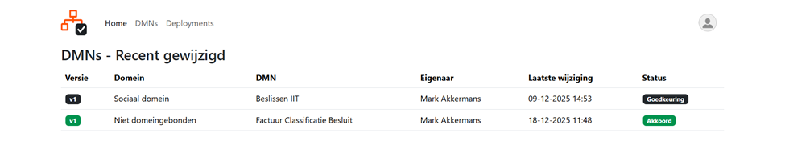

## DMNs
Als in het hoofdmenu op 'DMNs' wordt geklikt worden alle beschikbare DMN-modellen getoond.

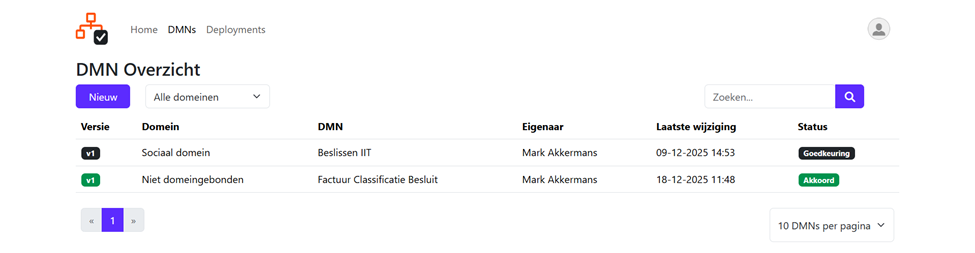

Op deze pagina wordt de volgende functionaliteit geboden:

| Knop | Resultaat |
| ------------------------------------ | ---------------------------------------------------------------- |
| 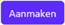 | Aanmaken van een nieuw DMN-model (zie [Nieuwe DMN aanmaken](#nieuwe-dmn-aanmaken)). |
| 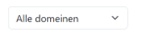 | Filteren van DMN-modellen op ‘domein’. |
| 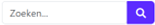 | Zoeken op (een gedeelte) van de naam van een DMN-model.          |
| 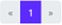 | Bladeren door de pagina's met DMN-modellen.                      |
| 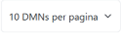 | Instellen van het aantal DMN-modellen per pagina.                |

Bij het klikken op één van de regels met een DMN-model wordt de detailpagina hiervan geopend (zie [Detailpagina](#detailpagina))

### Nieuwe DMN aanmaken
Op deze pagina kan een nieuw DMN-model worden aangemaakt.
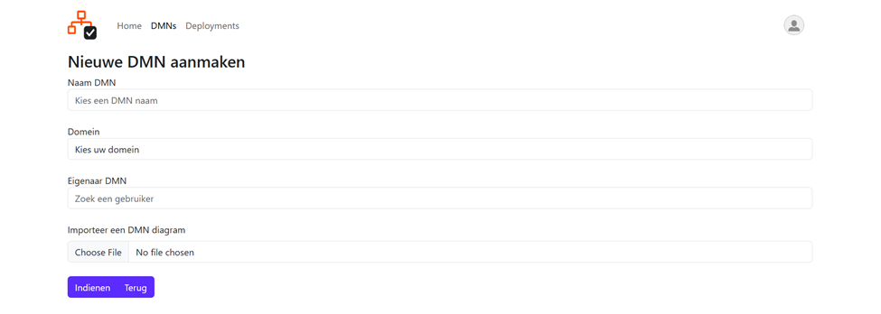

Hier dienen de volgende gegevens te worden ingevuld:

- ‘Naam DMN’; De naam van het DMN-model.
- 'Domein'; Het domein waarvoor dit DMN-model bedoeld is (dit is een dropdown waaruit een domein moet worden geselecteerd).
- 'Eigenaar DMN'; Gebruiker waarvoor dit model wordt gerealiseerd (dit is een dropdown waaruit een eigenaar moet worden geselecteerd).
- 'Importeer een DMN-diagram'; Optioneel kan hier een dmn(xml)-bestand worden geopend om dit als uitgangspunt te gebruiken voor het nieuwe DMN-model.
Door op  te klikken wordt het DMN-model met de ingevulde gegevens aangemaakt. Door op 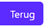 te klikken wordt het aanmaken van een nieuw DMN-model geannuleerd.

### Detailpagina
Op de detailpagina worden alle details van een DMN-model getoond:

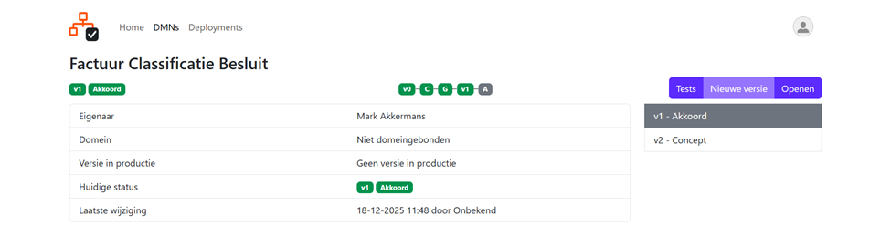

Bovenaan de details van het DMN-model wordt de voortgang getoond.  

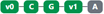

- ‘v0’ is het versienummer van het model waarop de getoonde versie is gebaseerd. Indien hier 'v0' wordt getoond betreft het een initiële versie
- ‘C’ geeft de status aan dat het model in concept (realisatie) is
- 'G' geeft aan dat het model wacht op goedkeuring
- 'V1' is het versienummer van het aangepaste model
- 'A' geeft de status aan dat de betreffende versie van het model is gearchiveerd, wat betekent dat er een actuelere goedgekeurde versie is.

| Knop | Resultaat |
| ------------------------------------ | ------------------------------------------------------------------------------------------------------------------------------------------------------------------------------------------------------------------------------------- |
| 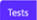 | Testen en inzien van eerder uitgevoerde testen van de getoonde versie van een DMN model (zie [Testpagina](#testpagina))|
| 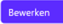| Aanpassingen maken op een bestaand DMN-model door een nieuwe 'concept' versie aan te maken (zie [Nieuwe DMN versie](#nieuwe-dmn-versie)). Dit kan alleen wanneer de laatste versie in productie is genomen en er geen andere versies in concept staan. |
|  | De getoonde versie van een DMN-model weergeven in de DMNStudio-modeller (zie [DMN viewer](#dmn-viewer))|
| 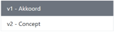 | Switchen tussen de beschikbare versies van een DMN-model|

### Testpagina
Op deze pagina worden eerder uitgevoerde tests getoond en kunnen er nieuwe tests worden aangemaakt en uitgevoerd voor een DMN-model.

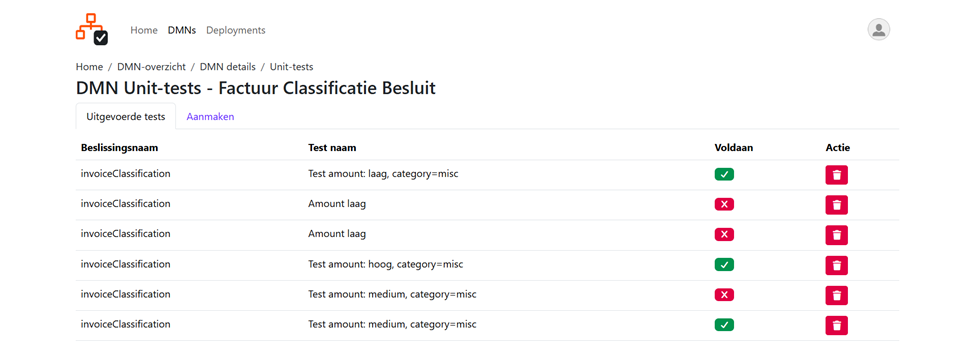

Eerder uitgevoerde tests kunnen worden verwijderd door op  te klikken in de ‘Actie’ kolom.

Door op een uitgevoerde test uit het lijstje te klikken worden de details van die test getoond (zie [Uitgevoerde tests](#uitgevoerde-tests)).

Door op het tabblad ‘Aanmaken’ te klikken kan er een nieuwe test worden aangemaakt (zie [Aanmaken test](#aanmaken-test)).
#### Uitgevoerde tests
Deze pagina toont de details van de geselecteerde test zoals hieronder weergegeven.

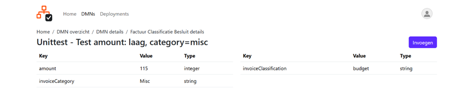

Vanuit deze pagina kan vervolgens een nieuwe test worden aangemaakt voor het gekozen DMN-model door op 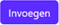 te klikken.

Op de daaropvolgende pagina de gewenste test worden ingevoerd en uitgevoerd (zie [Testen](#testen)).
#### Aanmaken test

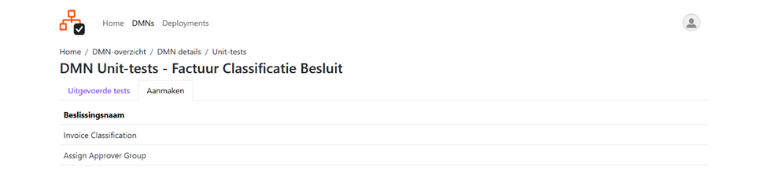

Vanuit deze pagina kan vervolgens een beslissing worden aangeklikt waarvoor een test moet worden aangemaakt.

Op de daarop volgende pagina de gewenste test worden ingevoerd en uitgevoerd (zie [Testen](#testen)).

#### Testen
Voor het aanmaken van een nieuwe test wordt de onderstaande pagina weergegeven.

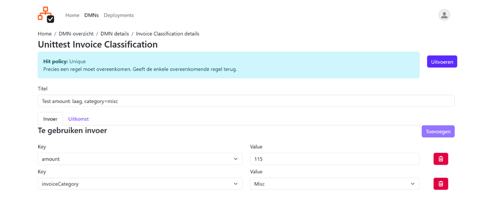

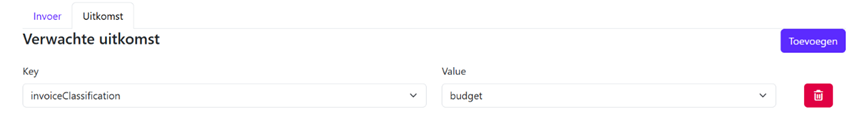

Hier dienen de volgende gegevens te worden ingevuld:

- Titel; De titel die gegeven wenst te worden aan de test
- Invoer
	- Key; Hier dient de naam van een beschikbaar **invoerveld** te worden geselecteerd
	- Value; Hier kan de gewenste waarde worden ingevuld of geselecteerd voor het **invoerveld**

- Uitkomst
	- Key; Hier dient de naam van een beschikbaar **uitkomstveld** te worden geselecteerd
	- Value; Hier kan de te verwachten waarde worden ingevuld of geselecteerd voor het **uitkomstveld**
Door op 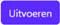te klikken wordt vervolgens de aangemaakte test uitgevoerd en als resultaat wordt één van onderstaande Test rapporten (Succesvol OF Niet succesvol) getoond.

<u>Succesvol resultaat:</u>

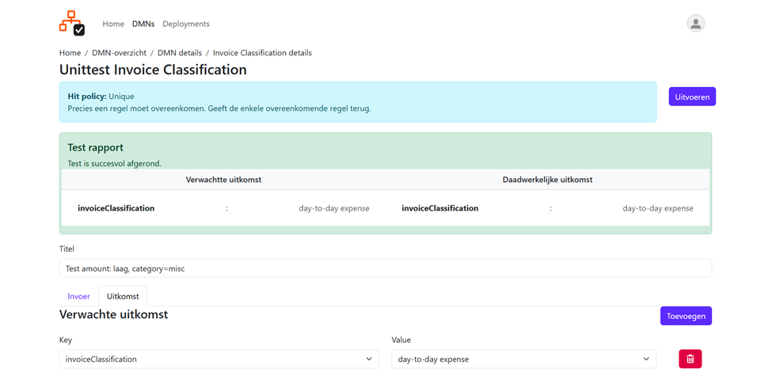

<u>Niet succesvol resultaat:</u>

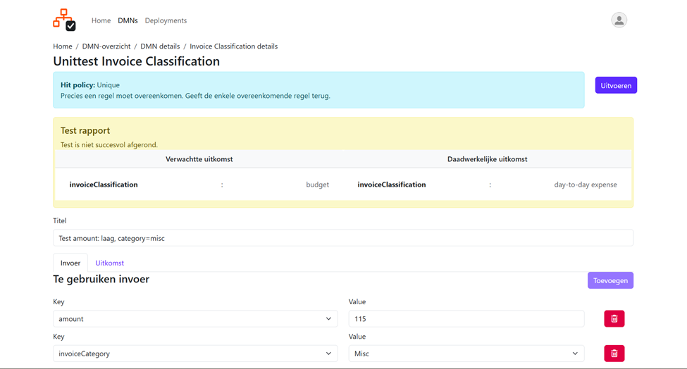

### Nieuwe DMN versie
Op deze pagina kan een nieuwe versie voor een bestaand DMN model worden aangemaakt.

Hierbij kan in de dropdown gekozen worden voor de volgende opties:

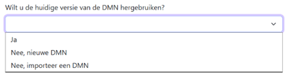

- ‘Ja’; Nieuwe versie baseren op de vorige versie.
- ‘Nee, nieuwe DMN’; Nieuwe versie vanaf scratch aanmaken.
- ‘Nee, importeer een DMN’; Nieuwe versie baseren op een ‘extern’ DMN(XML)-bestand.
Na het klikken op  wordt de DMN viewer (Decision modeller) geopend op basis van de geselecteerde keuze.

### DMN viewer
Op deze pagina wordt het DMN model in de Decision modeller getoond.

De pagina wordt initieel geopend met het decision model in alleen lezen modus zoals hieronder weergegeven.

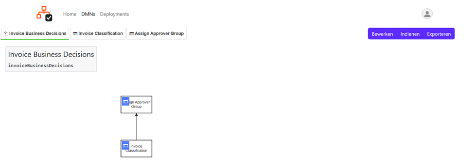

Bovenaan zijn tabbladen beschikbaar om door te kunnen springen naar een specifieke decision tabel uit het model zoals hieronder als voorbeeld is weergegeven. Klikken op een decision tabel in het model heeft hetzelfde resultaat.

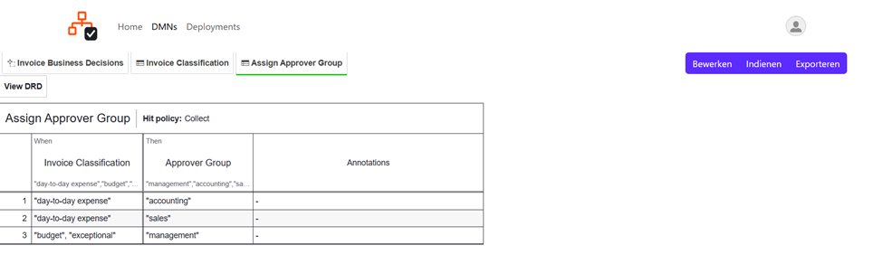

| Knop | Resultaat |
| ------------------------------------ | ------------------------------------------------------------------------------------------- |
|  | Het getoonde Decision model openen voor bewerking.                                          |
| 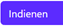 | Het getoonde Decision model aanbieden ter goedkeuring (zie [DMN Review](#dmn-review)).                |
| 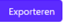 | Het getoonde Decision model exporteren oftewel downloaden in het standaard DMN(XML)-format. |
### DMN review
#### Aanbieden ter review en goedkeuring
Op deze pagina kan een specifieke versie van een DMN model ter review en goedkeuring worden aangeboden.

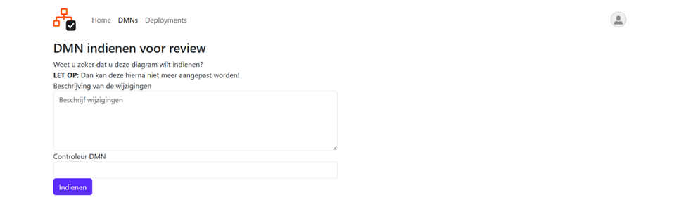

Hier kan een beschrijving van de wijziging worden vermeld en kan er uit de dropdown een gebruiker te worden geselecteerd die de review en goedkeuring dient uit te voeren.
#### Review selecteren
De aangewezen controleur zal in het overzicht van DMNs vervolgens het te reviewen DMN-model kunnen selecteren. Op de dan zoals onderstaand weergegeven pagina kan vervolgens door de controleur de uitgevoerde test worden bekeken en nieuwe worden aangemaakt (zie [Testpagina](#testpagina)) alsook het model worden geopend in de Decision modeller (zie [DMN Viewer](#dmn-viewer)) net als de developer.

Daarnaast kan de controleur op deze pagina op klikken om daarmee de daadwerkelijk review en goedkeuring uit te voeren (zie [Nakijken](#nakijken)).

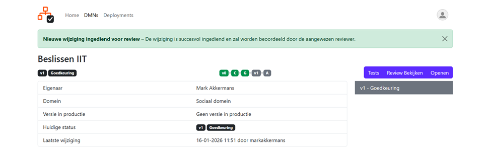

#### Nakijken
Op deze pagina ziet de controleur nogmaals de details van de te reviewen versie van een DMN model.

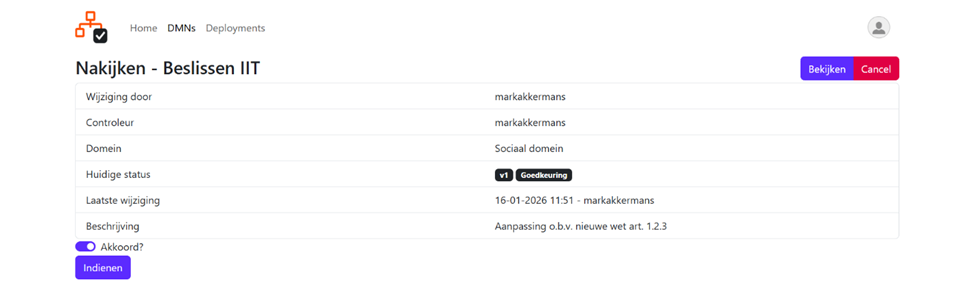

Op deze pagina wordt verder de volgende functionaliteit geboden:

| Knop | Resultaat |
| ------------------------------------ | ------------------------------------------------------------------------------------------------------------------------------------------------------------------------------------------------------------------------------------------ |
| 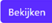 | Hiermee kan de controleur nogmaals het DMN model inzien. |
| 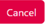| Hiermee wordt het verzoek om na te kijken gecanceld en daarmee verwijderd. |
| 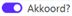 | Door deze schuif aan te zetten naar rechts kan het nakijken wel of niet geakkoordeerd worden. |
|  | Hiermee kan het erboven geselecteerde akkoord OF niet-akkoord worden ingediend. Bij niet-akkoord gaat de versie weer terug naar concept en bij akkoord kan deze vervolgens worden uitgerold naar de decision-engine (zie [Deployments](#deployments)).|

## Deployments
Als in het hoofdmenu op 'Deployments' wordt geklikt worden alle deployments getoond van de verschillende DMN modellen.

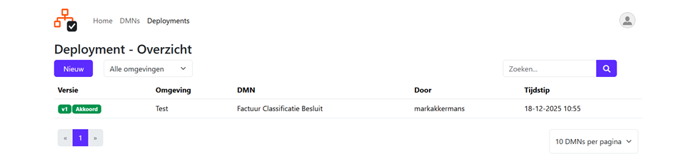

Op deze pagina wordt de volgende functionaliteit geboden:

| Knop | Resultaat |
| ------------------------------------ | ------------------------------------------------------------------------------- |
|  | Aanmaken van een nieuwe deployment van een DMN-model (zie Deployment aanmaken). |
| 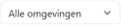 | Filteren van deployments voor een specifieke ‘omgeving’.  |
|  | Zoeken op een gedeelte van de naam van een DMN-model. |
|  | Bladeren door de pagina's met DMN-modellen. |
|  | Instellen van het aantal DMN-modellen per pagina. |

### Deployment aanmaken
Op deze pagina kan een uitrol van een specifieke versie van een DMN model worden uitgevoerd naar een op te geven omgeving (test, acceptatie, productie)

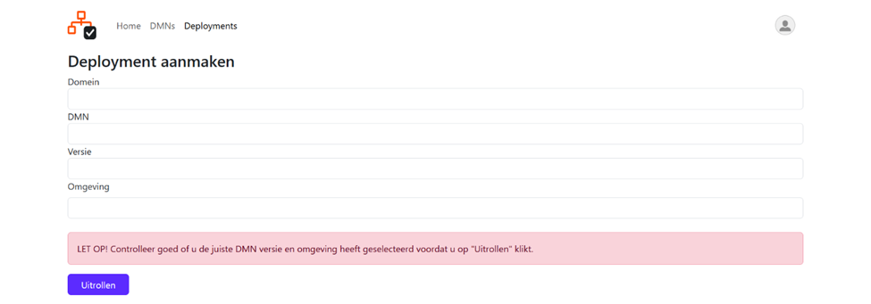

Hier dienen de volgende gegevens te worden ingevuld (als er bijvoorbeeld voor een domein of DMN geen versie beschikbaar is om uit te rollen zal de betreffende dropdown en daaropvolgende leeg blijven):
- ‘Domein’; Selecteer hier het domein waaruit een DMN dient te worden uitgerold.
- ‘DMN’; Selecteer hier een DMN-model uit het gekozen domein.
- ‘Versie’; Selecteer hier een versie van het DMN-model.
- ‘Omgeving’; Kies hier de omgeving waar het DMN-model dient te worden uitgerold.
Na het klikken op 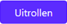 wordt er teruggekeerd naar het ‘Deployment overzicht’ en wordt er een melding getoond van de uitrol van de zojuist aangemaakte deployment.

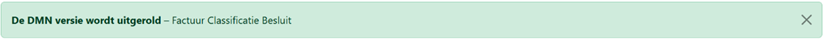

## Uitloggen
Bovenaan rechts van de applicatie is de mogelijkheid om uit te loggen. Als op het icoontje wordt geklikt verschijnt de naam van de ingelogde gebruiker met daaronder de optie 'Log uit' om uit te loggen.

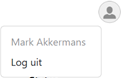